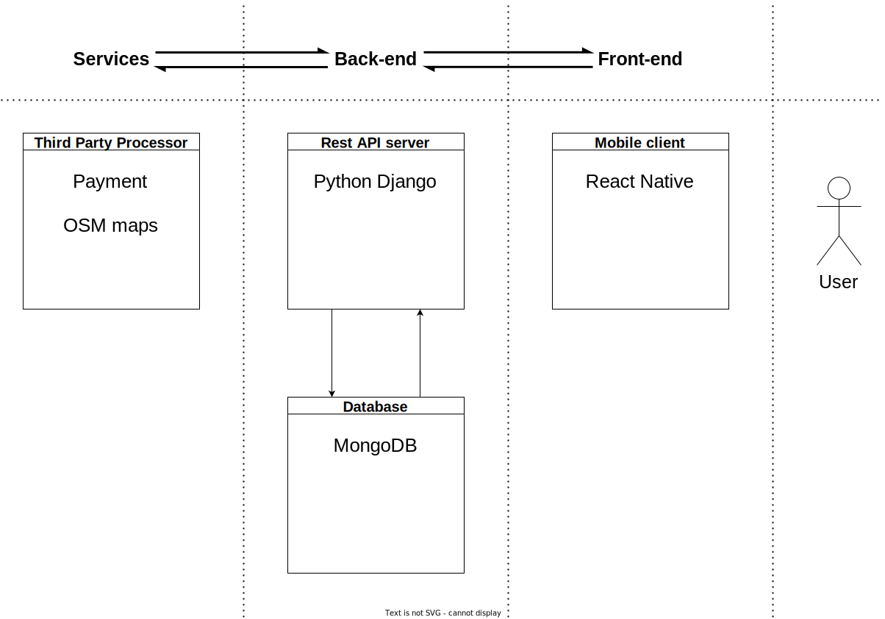

This README will be used temporarily to track the team's progress.  

*note: this is just a quick overview of what the team did, we might have missed adding some things*.

# WEEK of 10th January

Daily meetings to look for a suitable project for the team  

Brainstorming ideas taking  in consideration the team's tech strenghts  

# WEEK of 17th January

Team agreed on Latebox idea.  

Members of the team went in person to find some clients by presenting the project door-to-door.  

Had a meeting with the prof, to inform him of the efforts the team is doing to find a client  

# WEEK of 24th January

Members of the team still looking for a client.

Discussions to choose the technology stack that the team will use  

Team agreed on the following but not confirmed until further researches:  
- Django for the REST API service  
- MongoDB for database  
- React Native for the mobile client  

We drew a quick overview of what the different component of the app would be and how they'll be connected  

  

Team created two repositories:  
- [Frontend Repository](https://github.com/LateBox/frontend)  
- [Backend Repository](https://github.com/LateBox/backend)  

# WEEK of 31th January

Team decided to start looking for clients abroad as well as in Canada.

Team Discussed again the technological stack and thought we'd better go with the following:  

- Spring for the REST API service  
- PostgreSQL for database  
- React Native for the mobile client  

Team merged both repos into one [LateBox Repository](https://github.com/LateBox/latebox), and created subdirectory for each previous repo.  
